<!-- TOC -->

- [Architecture and diagrams](#architecture-and-diagrams)
  - [1. The CDK workflow: from Python code to AWS resources](#1-the-cdk-workflow-from-python-code-to-aws-resources)
  - [2. The local environment: floci and its consoles](#2-the-local-environment-floci-and-its-consoles)
  - [3. Repository wiring: config, tagging, naming, and the module contract](#3-repository-wiring-config-tagging-naming-and-the-module-contract)
  - [4. Example: how one module's AWS resources relate to each other (module 03, VPC)](#4-example-how-one-modules-aws-resources-relate-to-each-other-module-03-vpc)
  - [5. Regenerating these diagrams](#5-regenerating-these-diagrams)
  - [References](#references)

<!-- TOC -->

# Architecture and diagrams

This document is the visual companion to [`CLAUDE.md`](../CLAUDE.md) and
[`REQUIREMENTS.md`](../REQUIREMENTS.md): four diagrams that show how a
`cdk deploy` in this repository turns into running (emulated) AWS
resources, how the optional floci consoles fit together, how the shared
`config`/`tagging`/`naming` modules wire into every `modules/NN_service/stack.py`,
and, concretely, how the resources of one module (`modules/03_vpc`, the
reference module every other module was written to match) relate to each
other.

Each diagram exists as a [Mermaid](https://mermaid.js.org/) source file
under [`docs/diagrams/`](diagrams/) and a rendered SVG under
[`docs/images/`](images/) embedded below - see
[section 5](#5-regenerating-these-diagrams) for how the SVGs were produced
and validated, and how to regenerate them after editing a `.mmd` file.

## 1. The CDK workflow: from Python code to AWS resources

What `uv run cdk synth`/`deploy`/`destroy` actually do, from editing a
`stack.py` to resources existing (in floci or in a real AWS account) and
back to nothing:



- `cdk synth` only ever reads your code and the shared `config`/`tagging`/`naming`
  modules - it needs no AWS credentials and cannot create anything, which is
  why [`REQUIREMENTS.md` section 0](../REQUIREMENTS.md#0-zero-to-your-first-deploy-in-order)
  recommends running it constantly while learning.
- `cdk deploy` is the only command in this diagram that talks to an actual
  endpoint - `http://localhost:4566` (floci) when `AWS_ENDPOINT_URL` is set
  per [`.env.example`](../.env.example), or a real AWS account/region
  otherwise (see [`shared/config.py`](../shared/config.py)'s
  `get_environment()`).
- `cdk destroy` reverses `cdk deploy` against whichever endpoint the
  terminal is currently pointed at - always run it before switching a
  module from floci to a real account, or vice versa.

## 2. The local environment: floci and its consoles

`docker-compose.yml` runs one required service (`floci`) and two optional,
independent console profiles (`floci-ui`, `floci-dash`) - see
[`REQUIREMENTS.md` section 5](../REQUIREMENTS.md#5-running-floci-the-local-aws-emulator)
for the full explanation of each:



- The AWS CDK CLI, the AWS CLI, and `boto3` all talk to the same single
  endpoint, `floci:4566`, once `AWS_ENDPOINT_URL=http://localhost:4566` is
  set - this is the only network call in the whole local setup that matters
  for actually creating resources.
- The built-in console (`http://localhost:4566/_floci/ui`) is enabled by
  `FLOCI_SERVICES_UI_ENABLED: "true"` on the `floci` service itself and
  needs no extra profile - it is enough for every module in this learning
  path.
- `floci-ui`/`floci-api` (`--profile floci-ui`) and `floci-dash`
  (`--profile floci-dash`) are two unrelated, optional projects that each
  point at this same `floci` container rather than running a second
  emulator - they can be enabled together or not at all.

## 3. Repository wiring: config, tagging, naming, and the module contract

How the module contract in
[`CLAUDE.md` section 3](../CLAUDE.md#3-the-module-contract) is actually
wired together in code - from a `.env` value to a tagged, named,
synthesized (and tested) resource:



- `app.py` never imports a module by name - it discovers every
  `modules/*/stack.py` with `pkgutil.iter_modules()` and instantiates its
  `STACK_CLASS` with the one shared `AppConfig` and `cdk.Environment`, which
  is what lets a new module be added without editing `app.py` (see
  [`CLAUDE.md` section 3](../CLAUDE.md#3-the-module-contract)).
- `shared/tagging.py` and `shared/naming.py` are called from inside each
  `stack.py`, not from `app.py` - every module applies the same 7 tags and
  the same naming scheme to its own resources (see
  [`REQUIREMENTS.md` sections 7-8](../REQUIREMENTS.md#7-tagging-policy)).
- Each module's unit test (`tests/unit/test_NN_service.py`) builds the
  stack from the same `config` fixture and asserts against its synthesized
  template - not against a deployed floci/AWS resource - see
  [`docs/TESTING.md`](TESTING.md).

## 4. Example: how one module's AWS resources relate to each other (module 03, VPC)

`modules/03_vpc` is the reference module every other module was written to
match (see [`CLAUDE.md` section 2](../CLAUDE.md#2-directory-and-file-structure)).
This is exactly what its `ec2.Vpc(..., max_azs=2, nat_gateways=0, subnet_configuration=[...])`
call ([`modules/03_vpc/stack.py`](../modules/03_vpc/stack.py)) creates and
how those resources relate to each other:



- One VPC, one Internet Gateway (created and attached automatically by the
  `ec2.Vpc` L2 construct - see
  [`modules/03_vpc/README.md`](../modules/03_vpc/README.md)), 4 subnets (one
  public and one private-isolated subnet per Availability Zone, `max_azs=2`),
  and one security group scoped to the VPC.
- Each subnet gets its own route table; only the two public subnets' route
  tables have a route to the Internet Gateway - the private-isolated
  subnets have no internet route at all, which is what `nat_gateways=0`
  and `PRIVATE_ISOLATED` (instead of `PRIVATE_WITH_EGRESS`) mean in
  practice.
- The security group's only ingress rule allows TCP 443 from the VPC's own
  CIDR block (`10.0.0.0/16`) - nothing outside the VPC can reach it.
- This same shape - one or two central resources with several dependent
  resources wired to them by the L2 construct - repeats throughout the
  other 43 modules; each module's own README documents its specific
  resources under "AWS services and CDK constructs used".

## 5. Regenerating these diagrams

The `.mmd` files under [`docs/diagrams/`](diagrams/) are the source of
truth; the `.svg` files under [`docs/images/`](images/) are generated from
them with the [Mermaid CLI](https://github.com/mermaid-js/mermaid-cli)
(`@mermaid-js/mermaid-cli`), using Node.js/npm - already a prerequisite for
the AWS CDK Toolkit, see
[`REQUIREMENTS.md` section 3](../REQUIREMENTS.md#3-required-software) - so
no extra install is needed beyond `npx`:

```bash
# From the repository root, after editing any docs/diagrams/*.mmd file:
npx --yes @mermaid-js/mermaid-cli \
  -i docs/diagrams/01-cdk-workflow.mmd \
  -o docs/images/01-cdk-workflow.svg \
  -b white -c docs/diagrams/mermaid-config.json
```

Repeat for `02-floci-environment`, `03-module-contract`, and
`04-vpc-resources`. `docs/diagrams/mermaid-config.json` pins Mermaid's
`default` theme (instead of the CLI's default hand-drawn "neo" theme,
which embeds a full variable font per file and inflates each SVG from
~20 KB to ~200 KB for no benefit in a git-tracked file). A `.mmd` file that
fails to render (a syntax error) makes `mmdc` exit non-zero and print the
parse error instead of writing an SVG - that failure is what "validating"
a diagram in this repository means; every SVG under `docs/images/` was
produced by a successful run of the command above and visually reviewed
before being committed.

## References

- [Mermaid - Diagram syntax](https://mermaid.js.org/intro/) · [Mermaid CLI (`@mermaid-js/mermaid-cli`)](https://github.com/mermaid-js/mermaid-cli)
- [AWS CDK v2 Developer Guide - Home](https://docs.aws.amazon.com/cdk/v2/guide/home.html)
- [AWS CDK API Reference (Python) - `aws_cdk.aws_ec2.Vpc`](https://docs.aws.amazon.com/cdk/api/v2/python/aws_cdk.aws_ec2/Vpc.html)
- [floci - Local AWS Emulator](https://floci.io) · [floci - AWS service coverage](https://floci.io/aws/)
- [github.com/floci-io/floci-ui](https://github.com/floci-io/floci-ui) · [github.com/ofsazib/floci-dash](https://github.com/ofsazib/floci-dash)
